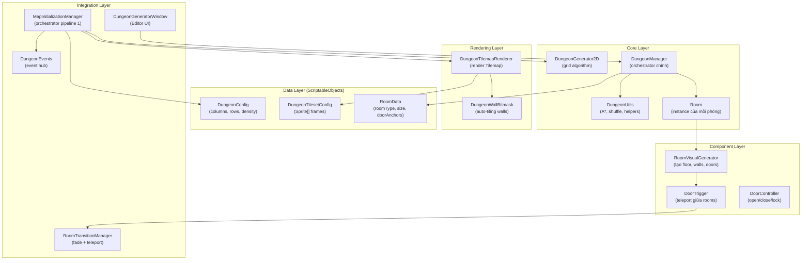

# 🗺️ Auto-gen Map / Dungeon Generation — Tài liệu chi tiết

> **Dự án**: No Way Out  
> **Nhánh**: `feature/auto-gen-map`  
> **Ngày tạo**: 23/02/2026  
> **Namespace chính**: `NWO.Dungeon`, `ProceduralGeneration.Core`, `ProceduralGeneration.Components`, `ProceduralGeneration.Data`, `Core`

---

## Mục lục

1. [Tổng quan hệ thống](#1-tổng-quan-hệ-thống)
2. [Kiến trúc & Sơ đồ lớp](#2-kiến-trúc--sơ-đồ-lớp)
3. [Flow làm việc (Workflow)](#3-flow-làm-việc-workflow)
4. [Thao tác tay trong Unity Editor](#4-thao-tác-tay-trong-unity-editor)
5. [Giải thích Code chi tiết](#5-giải-thích-code-chi-tiết)
6. [Danh sách file liên quan](#6-danh-sách-file-liên-quan)
7. [Câu hỏi Review (15 câu)](#7-câu-hỏi-review-15-câu)

---

## 1. Tổng quan hệ thống

Hệ thống Dungeon Generation trong No Way Out sử dụng **Procedural Content Generation (PCG)** để tạo bản đồ dungeon tự động mỗi lần chơi. Hệ thống có **2 pipeline song song**:

| Pipeline                                      | Mô tả                                                                                                             | Entry Point                                                                  |
| --------------------------------------------- | ----------------------------------------------------------------------------------------------------------------- | ---------------------------------------------------------------------------- |
| **Pipeline 1 — Grid-based (Legacy/BSP-like)** | Tạo dungeon dạng lưới 2D với rooms + tunnels, render bằng Tilemap                                                 | `MapInitializationManager` → `DungeonGenerator2D` → `DungeonTilemapRenderer` |
| **Pipeline 2 — Room-flow (Chính)**            | Tạo dungeon theo flow cố định: Start → Arch1 → MidBoss → Arch2 → Boss → Goal, sử dụng ScriptableObject `RoomData` | `DungeonManager` → `Room` → `RoomVisualGenerator` → `DoorTrigger`            |

**Pipeline 2** là pipeline đang được sử dụng chính trong game.

### Dungeon Flow

```
┌───────┐    ┌────────────┐    ┌─────────┐    ┌────────────┐    ┌──────┐    ┌──────┐
│ START │───▶│ Archetype1 │───▶│ MidBoss │───▶│ Archetype2 │───▶│ Boss │───▶│ Goal │
└───────┘    │  (5 rooms) │    └─────────┘    │  (5 rooms) │    └──────┘    └──────┘
             └────────────┘                   └────────────┘
                   │                                │
                   ▼                                ▼
              Branch rooms                     Branch rooms
              (20% chance)                     (20% chance)
```

---

## 2. Kiến trúc & Sơ đồ lớp



---

## 3. Flow làm việc (Workflow)

### 3.1. Flow tổng quan khi Generate Dungeon (Runtime)

```
1. DungeonManager.GenerateDungeon()
   │
   ├── 1a. Setup seed (random hoặc fixed)
   │       Random.InitState(currentSeed)
   │
   ├── 1b. ClearDungeon()
   │       Destroy tất cả children của DungeonContainer
   │
   ├── 1c. Initialize()
   │       Tạo Dictionary<Vector2Int, Room> occupiedCells
   │       Tạo List<Room> allRooms, mainPath
   │
   ├── 2. GenerateDungeonFlow()
   │   ├── CreateStartRoom()         → Room(RoomType.Start) tại (0,0)
   │   ├── CreateRoomSequence(Arch1)  → 5 phòng nối tiếp
   │   ├── CreateRoomOfType(MidBoss)  → 1 phòng mid-boss
   │   ├── CreateRoomSequence(Arch2)  → 5 phòng nối tiếp
   │   ├── CreateRoomOfType(Boss)     → 1 phòng boss
   │   ├── CreateGoalRoom()           → 1 phòng kết thúc
   │   └── CalculateDangerLevels()    → Tính danger theo khoảng cách
   │
   ├── 3. InstantiateAllRooms()
   │   ├── Room.InstantiateRoom()     → Tạo GameObject, add RoomVisualGenerator
   │   ├── Room.ConfigureVisualGenerator() → Truyền tile references
   │   ├── Room.GenerateVisuals()     → Tạo Floor Tilemap + Wall Tilemap + Doors
   │   └── SetActive(false) tất cả trừ START room
   │
   ├── 4. EnsureTransitionManager()
   │       Auto-create RoomTransitionManager nếu chưa có
   │
   └── 5. isGenerated = true ✅
```

### 3.2. Flow đặt phòng (Room Placement Algorithm)

```
TryPlaceRoom(roomData, fromRoom)
│
├── 1. GetAvailableDirections(fromRoom)
│      Tìm các hướng chưa có phòng kết nối (Top/Bottom/Left/Right)
│
├── 2. DungeonUtils.Shuffle(directions)
│      Fisher-Yates shuffle để random hướng
│
├── 3. CalculateAdjustedRoomSize(roomData)
│      Đảm bảo size luôn là số LẺ, clamp theo roomType
│
├── 4. Thử từng hướng:
│   ├── Tính scaledOffset = direction × fromRoom.actualSize
│   ├── newPosition = fromRoom.gridPosition + scaledOffset
│   ├── CanPlaceRoomAt(newPosition, adjustedSize, occupiedCells)?
│   │   └── Check tất cả grid cells không bị overlap
│   └── Kiểm tra door compatibility (requiredDoor)
│
├── 5. Nếu thành công:
│      ├── new Room(roomData, newPosition, adjustedSize)
│      ├── AddRoomToGrid(newRoom) → đánh dấu occupiedCells
│      └── Connect rooms hai chiều: fromRoom ↔ newRoom
│
└── 6. Nếu thất bại: Backtracking
       Thử lại với các phòng trước đó trên mainPath
```

### 3.3. Flow chuyển phòng (Room Transition)

```
Player đi vào DoorTrigger
│
├── 1. Update() kiểm tra khoảng cách player (detectionRange = 4f)
│      → Nếu gần: OpenDoor() (collider = trigger)
│      → Nếu xa: CloseDoor() (collider = solid)
│
├── 2. OnTriggerEnter2D() khi player chạm trigger
│      → TriggerRoomTransition(player)
│
└── 3. RoomTransitionManager.TransitionToRoom()
       ├── FadeOut() (CanvasGroup alpha 0→1)
       ├── fromRoom.SetActive(false)
       ├── toRoom.SetActive(true)
       ├── ConvertRoomSpritesToLit() (chuyển material sang URP Lit)
       ├── Teleport player đến vị trí đối diện cửa vào
       └── FadeIn() (CanvasGroup alpha 1→0)
```

---

## 4. Thao tác tay trong Unity Editor

### 4.1. Setup ban đầu

| Bước | Thao tác            | Chi tiết                                                                                                                            |
| ---- | ------------------- | ----------------------------------------------------------------------------------------------------------------------------------- |
| 1    | Tạo RoomData assets | `Assets > Create > Procedural Generation > Room Data`. Tạo ít nhất 6 assets cho: Start, Archetype1, Archetype2, MidBoss, Boss, Goal |
| 2    | Cấu hình RoomData   | Mỗi RoomData cần: `roomType`, `size` (ví dụ: 15×15), `doorAnchors` (thêm 4 hướng: Top, Bottom, Left, Right)                         |
| 3    | Tạo DungeonManager  | Menu `Tools > Procedural Generation > Dungeon Generator` → Click "Create New Manager"                                               |
| 4    | Gán Room Database   | Kéo các RoomData vào `roomDatabase` list trong Inspector của DungeonManager                                                         |
| 5    | Gán Tile assets     | Kéo tile sprites vào các slot: `floorTiles[]`, `wallCenter`, `wallTop`, `wallBottom`, v.v.                                          |
| 6    | Gán Door Prefab     | Kéo door prefab có animation vào `doorPrefab` slot                                                                                  |

### 4.2. Generate Dungeon trong Editor

| Bước | Thao tác                                                           |
| ---- | ------------------------------------------------------------------ |
| 1    | Mở cửa sổ `Tools > Procedural Generation > Dungeon Generator`      |
| 2    | (Tùy chọn) Bật "Use Custom Seed" và nhập seed number               |
| 3    | Click **"🏗️ GENERATE DUNGEON"**                                    |
| 4    | Kiểm tra Hierarchy — DungeonContainer sẽ chứa các Room GameObjects |
| 5    | (Tùy chọn) Click **"💾 SAVE MAP AS PREFAB"** để lưu bản đồ         |
| 6    | Click **"🗑️ CLEAR DUNGEON"** để xóa và generate lại                |

### 4.3. Cấu hình Inspector quan trọng

```
DungeonManager (Inspector)
├── Generation Settings
│   ├── Seed: 0 (0 = random)
│   └── Use Random Seed: ✅
├── World Scale: 1.0 (1 grid cell = 1 world unit)
├── Dungeon Flow Configuration
│   ├── Archetype1 Room Count: 5
│   ├── Archetype2 Room Count: 5
│   └── Branch Probability: 0.2
├── Room Data: [6 RoomData assets]
├── Tile Configuration
│   ├── Auto Fill Tiles: ✅
│   ├── Floor Tiles: [array of TileBase]
│   └── Wall Tiles: [9 directional TileBase]
├── Door Prefab: [Door prefab with Animator]
└── Debug: Show Debug Gizmos ✅
```

---

## 5. Giải thích Code chi tiết

### 5.1. `DungeonGenerator2D.cs` — Thuật toán sinh dungeon lưới

**Vị trí**: `Assets/Settings/Dungeon/Generation/DungeonGenerator2D.cs`

Đây là thuật toán BSP-like (Binary Space Partition) port từ microStudio:

```csharp
// BƯỚC 1: Khởi tạo mảng 1D (row-major) toàn tường
var map = new DungeonMap { Columns = innerCols, Rows = innerRows,
                           Cells = new DungeonCell[innerCols * innerRows] };
Fill(map, DungeonCell.Wall);
```

**Giải thích**: Map được lưu dưới dạng mảng 1D phẳng, truy cập qua `index = row * Columns + column`. Đây là cách tối ưu bộ nhớ so với mảng 2D.

```csharp
// BƯỚC 2: Random placement loop — thử đặt phòng cho đến khi hết density
while (true) {
    newRoom.Column = rng.Next(innerCols - newRoom.Width);
    newRoom.Row = rng.Next(innerRows - newRoom.Height);
    if (CanPlaceRoom(map, newRoom)) break;  // Thành công
    if (attempts > density) break;           // Hết lượt thử
    attempts++;
}
if (attempts > density) break; // Kết thúc vòng lặp ngoài
```

**Giải thích**: `density` kiểm soát số lần thử trước khi dừng. Giá trị cao = nhiều phòng hơn. Mỗi phòng được random vị trí và kiểm tra overlap bằng `CanPlaceRoom()`.

```csharp
// BƯỚC 3: Tạo đường hầm (tunnel) nối 2 phòng liên tiếp
// 50% theo L-shape ngang-trước, 50% theo L-shape dọc-trước
if (rng.NextDouble() < 0.5) {
    CreateTunnelHorizontally(map, startColumn, endColumn, startRow);
    CreateTunnelVertically(map, startRow, middleRow, endColumn);
} else {
    CreateTunnelVertically(map, startRow, endRow, startColumn);
    CreateTunnelHorizontally(map, startColumn, middleColumn, endRow);
}
```

**Giải thích**: Mỗi tunnel là hình chữ L — đi ngang rồi dọc, hoặc ngược lại. Random 50/50 để tạo đa dạng. Đây là kỹ thuật **"Drunkard's Walk with L-shaped corridors"**.

```csharp
// BƯỚC 4: Kiểm tra phòng có thể đặt không (collision detection)
private static bool CanPlaceRoom(DungeonMap map, Room room) {
    // Check vùng lớn hơn phòng 1 ô mỗi chiều (tạo khoảng cách giữa phòng)
    for (var r = room.Row - 1; r <= room.Row + room.Height + 1; r++)
    for (var c = room.Column - 1; c <= room.Column + room.Width + 1; c++) {
        if (!map.InBounds(c, r)) continue;
        if (map.Get(c, r) != DungeonCell.Wall) return false; // Có vật cản
    }
    return true;
}
```

**Giải thích**: Padding 1 ô mỗi chiều (`-1` đến `+1`) đảm bảo các phòng **không chạm nhau** trực tiếp — luôn có ít nhất 1 ô tường ngăn cách.

---

### 5.2. `DungeonManager.cs` — Orchestrator chính

**Vị trí**: `Assets/Scripts/ProceduralGeneration/Core/DungeonManager.cs` (1046 dòng)

#### Adjusted Room Size — Tại sao phải là số lẻ?

```csharp
private Vector2Int CalculateAdjustedRoomSize(RoomData roomData) {
    Vector2Int size = roomData.size;
    if (size.x % 2 == 0) size.x += 1; // Chẵn → Lẻ
    if (size.y % 2 == 0) size.y += 1;
    // START/GOAL: min 11×11, max 15×15
    // Phòng khác: min 15×15, max 25×25
    ...
}
```

**Giải thích**: Size lẻ đảm bảo luôn có **1 tile chính giữa** (center tile) — cần thiết để đặt cửa ở chính giữa cạnh. Ví dụ: phòng 15×15 → center = tile (7,7).

#### Backtracking — Khi không đặt được phòng

```csharp
// Khi tất cả hướng từ phòng cuối đều bị chặn:
for (int i = mainPath.Count - 2; i >= Math.Max(0, mainPath.Count - maxBacktrackAttempts); i--) {
    Room backtrackRoom = mainPath[i];
    Room result = TryPlaceRoom(roomData, backtrackRoom); // Thử đặt từ phòng cũ hơn
    if (result != null) return result;
}
```

**Giải thích**: Thuật toán "quay lui" tối đa 10 phòng trước đó. Điều này ngăn deadlock khi layout bị bao vây.

#### Scaled Offset — Tại sao nhân với actualSize?

```csharp
Vector2Int scaledOffset = new Vector2Int(
    offset.x * fromRoom.actualSize.x,  // Ví dụ: Right → (1,0) × 15 = (15,0)
    offset.y * fromRoom.actualSize.y
);
Vector2Int newPosition = fromRoom.gridPosition + scaledOffset;
```

**Giải thích**: Mỗi phòng chiếm **nhiều grid cells** (ví dụ 15×15). Offset phải bằng kích thước phòng trước đó để phòng mới nằm liền kề mà **không overlap**.

---

### 5.3. `Room.cs` — Đối tượng phòng

**Vị trí**: `Assets/Scripts/ProceduralGeneration/Core/Room.cs`

```csharp
public class Room {
    public RoomData roomData;                              // SO config
    public Vector2Int gridPosition;                        // Vị trí trên lưới
    public Vector2Int actualSize;                           // Kích thước thực (sau adjust)
    public Dictionary<DoorDirection, Room> connectedRooms;  // Kết nối 2 chiều
    public int distanceFromStart;                           // Dùng tính danger
    public bool isMainPath;                                 // Phòng trên đường chính?

    public void InstantiateRoom(Transform parent, float worldScale) {
        // Tạo empty GameObject, vị trí = gridPosition × worldScale
        Vector3 worldPosition = new Vector3(
            gridPosition.x * worldScale,
            gridPosition.y * worldScale, 0
        );
        roomInstance = new GameObject($"Room_{roomData.roomType}_{gridPosition.x}_{gridPosition.y}");
        // Add RoomVisualGenerator component
    }
}
```

**Giải thích**: Room là **pure C# class** (không phải MonoBehaviour) — chứa data logic. Khi instantiate, nó tạo một empty GameObject rồi add `RoomVisualGenerator` component để render visual. Tên theo format `Room_<type>_<x>_<y>` dùng để rebuild khi enter Play Mode.

---

### 5.4. `RoomVisualGenerator.cs` — Tạo visual cho phòng

**Vị trí**: `Assets/Scripts/ProceduralGeneration/Components/RoomVisualGenerator.cs`

#### Tạo Floor Tilemap với random tiles

```csharp
private void CreateAutoFilledFloor(Transform parent) {
    // ... tạo Grid + Tilemap ...
    // Fill sàn CHỈ interior (bỏ edges — đó là chỗ wall)
    for (int x = 1; x < tilesX - 1; x++) {
        for (int y = 1; y < tilesY - 1; y++) {
            TileBase randomTile = floorTiles[Random.Range(0, floorTiles.Length)];
            tilemap.SetTile(new Vector3Int(x, y, 0), randomTile);
        }
    }
}
```

**Giải thích**: Floor chỉ fill **vùng interior** (từ `1` đến `tilesX-2`), còn edge (x=0, x=max, y=0, y=max) dành cho wall. Random pick từ nhiều floor tile tạo variation tự nhiên.

#### Tạo Wall Tilemap với auto-tiling

```csharp
private void CreateAutoFilledWalls(Transform parent) {
    // Tính door tile positions — tạo "lỗ" cho cửa
    var doorTilePositions = new HashSet<Vector2Int>();
    foreach (var door in roomData.doorAnchors) {
        // Xóa 2 layers wall tại vị trí door (edge + inner)
        doorTilePositions.Add(edgeTile);
        doorTilePositions.Add(innerTile);
    }

    // Fill walls CHỈ ở edges, skip nơi có door
    for (int x = 0; x < tilesX; x++) {
        for (int y = 0; y < tilesY; y++) {
            bool isEdge = (isLeft || isRight || isTop || isBottom);
            if (!isEdge) continue;
            if (doorTilePositions.Contains(new Vector2Int(x, y))) continue;

            TileBase wallTile = GetWallTileForPosition(x, y, tilesX, tilesY);
            tilemap.SetTile(new Vector3Int(x, y, 0), wallTile);
        }
    }
}
```

**Giải thích**: Thêm `TilemapCollider2D` + `CompositeCollider2D` cho wall collision. Door positions xóa 2 tile (edge + inner) để player có thể đi qua.

#### Smart Wall Tile Selection

```csharp
private TileBase GetWallTileForPosition(int x, int y, int maxX, int maxY) {
    // 4 corners → 4 edges → center
    if (isTop && isLeft)  return wallTopLeft ?? wallCenter;
    if (isTop && isRight) return wallTopRight ?? wallCenter;
    if (isTop)            return wallTop ?? wallCenter;
    // ...  fallback dùng wallCenter nếu tile chuyên biệt chưa có
}
```

**Giải thích**: 9 loại wall tile (4 góc + 4 cạnh + center) tạo visual chính xác. Dùng **null-coalescing** (`??`) fallback về `wallCenter` khi chưa gán đủ assets.

---

### 5.5. `DoorTrigger.cs` — Hệ thống cửa thông minh

**Vị trí**: `Assets/Scripts/ProceduralGeneration/Components/DoorTrigger.cs`

```csharp
void Update() {
    if (autoOpenClose && !isLocked && player != null) {
        float distance = Vector2.Distance(transform.position, player.position);
        if (distance <= detectionRange && !isOpen) OpenDoor();
        else if (distance > detectionRange && isOpen) CloseDoor();
    }
}
```

**Giải thích**: Cửa tự động mở khi player lại gần (`detectionRange = 4f`) và **đóng lại** khi player đi xa. Điều này tạo UX mượt mà — không cần nhấn nút.

```csharp
// Dual-mode collider: Solid khi đóng, Trigger khi mở
private void UpdateColliderState() {
    if (isOpen) {
        doorCollider.isTrigger = true;  // Player đi qua → trigger transition
    } else {
        doorCollider.isTrigger = false; // Player bị chặn (solid wall)
    }
}
```

**Giải thích**: Thay vì dùng 2 collider riêng, chỉ cần **toggle `isTrigger`**. Khi đóng = solid wall chặn player. Khi mở = trigger area phát hiện player bước vào.

---

### 5.6. `RoomTransitionManager.cs` — Chuyển phòng mượt

**Vị trí**: `Assets/Scripts/Core/RoomTransitionManager.cs`

```csharp
private IEnumerator TransitionCoroutine(Room fromRoom, Room toRoom,
                                         DoorDirection doorDirection, GameObject player) {
    isTransitioning = true;
    yield return FadeOut();                      // Màn hình tối dần
    fromRoom.roomInstance.SetActive(false);       // Ẩn phòng cũ
    toRoom.roomInstance.SetActive(true);          // Hiện phòng mới
    ConvertRoomSpritesToLit(toRoom);              // Áp dụng URP 2D Lighting material
    player.transform.position = CalculatePlayerSpawnPosition(toRoom, doorDirection);
    yield return FadeIn();                       // Màn hình sáng dần
    isTransitioning = false;
}
```

**Giải thích**: Chỉ active **1 room tại 1 thời điểm** — tối ưu performance. `ConvertRoomSpritesToLit()` chuyển tất cả SpriteRenderer sang material `Sprite-Lit-Default` để URP 2D Light ảnh hưởng được.

---

### 5.7. `DungeonWallBitmask.cs` — Auto-tiling cho Pipeline 1

**Vị trí**: `Assets/Settings/Dungeon/Rendering/DungeonWallBitmask.cs`

```csharp
public static List<int> GetWallFrameIndexes(DungeonMap map, int column, int row) {
    bool Space(int dc, int dr) {
        return map.Get(column + dc, row + dr) != DungeonCell.Wall;
    }

    // Kiểm tra 8 hướng lân cận → xác định cần vẽ tile nào
    if (Space(0, -1)) {          // Có space ở dưới
        if (Space(-1, 0) && Space(1, 0)) indexes.Add(4);  // T-junction
        else if (Space(-1, 0)) indexes.Add(1);              // Corner trái
        // ...
    }
}
```

**Giải thích**: **Bitmask auto-tiling** — kiểm tra 4 ô lân cận (và 4 ô chéo) để xác định tile sprite phù hợp. Mỗi tổ hợp lân cận → 1 frame index trong tileset. Tạo ra wall seamless đẹp mắt.

---

### 5.8. `DungeonUtils.cs` — Tiện ích

**Vị trí**: `Assets/Scripts/ProceduralGeneration/Core/DungeonUtils.cs`

#### Fisher-Yates Shuffle

```csharp
public static void Shuffle<T>(List<T> list) {
    for (int i = list.Count - 1; i > 0; i--) {
        int j = Random.Range(0, i + 1);
        (list[i], list[j]) = (list[j], list[i]); // Swap
    }
}
```

**Giải thích**: O(n) unbiased shuffle — đảm bảo mỗi hoán vị có xác suất bằng nhau. Dùng để random hướng đặt phòng.

#### A\* Pathfinding giữa các phòng

```csharp
public static List<Room> FindPath(Room start, Room end, List<Room> allRooms) {
    // A* sử dụng Manhattan distance làm heuristic
    // Duyệt qua connectedRooms (graph edges)
    fScore[start] = ManhattanDistance(start.gridPosition, end.gridPosition);
    // ... standard A* loop ...
}
```

**Giải thích**: Graph pathfinding trên room graph (không phải tile grid). **Manhattan distance** (|Δx| + |Δy|) làm heuristic vì rooms chỉ kết nối theo 4 hướng (không chéo).

---

### 5.9. `DungeonEvents.cs` — Event-Driven Architecture

**Vị trí**: `Assets/Settings/Dungeon/Core/DungeonEvents.cs`

```csharp
public static class DungeonEvents {
    public static event Action<DungeonGenerator2D.Result> OnDungeonGenerated;
    public static event Action<DungeonMap> OnDungeonRendered;
    public static event Action OnEntitiesSpawned;
    public static event Action<Vector3> OnPlayerSpawned;
    public static event Action OnMapReady;

    public static void ClearAll() { /* Set tất cả = null */ }
}
```

**Giải thích**: **Static event hub** — cho phép các hệ thống khác (minimap, lighting, audio) subscribe mà không cần reference trực tiếp đến DungeonManager. `ClearAll()` ngăn memory leak khi chuyển scene.

---

### 5.10. `DungeonGeneratorWindow.cs` — Custom Editor Window

**Vị trí**: `Assets/Scripts/ProceduralGeneration/Editor/DungeonGeneratorWindow.cs`

```csharp
[MenuItem("Tools/Procedural Generation/Dungeon Generator")]
public static void ShowWindow() {
    GetWindow<DungeonGeneratorWindow>("Dungeon Generator").Show();
}

private void GenerateDungeon() {
    dungeonManager.GenerateDungeon();
    EditorSceneManager.MarkSceneDirty(dungeonManager.gameObject.scene);
}

private void SaveMapAsPrefab() {
    GameObject dungeonCopy = Instantiate(dungeonManager.dungeonContainer.gameObject);
    PrefabUtility.SaveAsPrefabAsset(dungeonCopy, prefabPath);
}
```

**Giải thích**: Custom Editor Window cho phép generate dungeon **trong Edit Mode** (không cần Play). `MarkSceneDirty()` đảm bảo thay đổi được lưu. Save as Prefab cho phép designer tạo và lưu nhiều layout.

---

## 6. Danh sách file liên quan

### Core Types & Config

| File                                               | Dòng | Vai trò                                                             |
| -------------------------------------------------- | ---- | ------------------------------------------------------------------- |
| `Assets/Settings/Dungeon/Core/DungeonTypes.cs`     | 39   | Enum `DungeonCell`, class `DungeonMap` (mảng 1D row-major)          |
| `Assets/Settings/Dungeon/Core/DungeonConfig.cs`    | 60   | ScriptableObject — map size, room size, density, spawn chances      |
| `Assets/Settings/Dungeon/Core/DungeonEvents.cs`    | 65   | Static event hub — 5 events cho dungeon lifecycle                   |
| `Assets/Settings/Dungeon/Core/IDungeonRenderer.cs` | 32   | Interface — `Render()`, `Clear()`, `GridToWorld()`, `WorldToGrid()` |

### Generation Algorithm

| File                                                       | Dòng | Vai trò                                       |
| ---------------------------------------------------------- | ---- | --------------------------------------------- |
| `Assets/Settings/Dungeon/Generation/DungeonGenerator2D.cs` | 213  | Thuật toán BSP-like sinh lưới rooms + tunnels |

### Rendering (Pipeline 1)

| File                                                          | Dòng | Vai trò                                            |
| ------------------------------------------------------------- | ---- | -------------------------------------------------- |
| `Assets/Settings/Dungeon/Rendering/DungeonTilemapRenderer.cs` | 271  | Render DungeonMap thành Tilemap với object pooling |
| `Assets/Settings/Dungeon/Rendering/DungeonWallBitmask.cs`     | 55   | Bitmask auto-tiling cho walls                      |
| `Assets/Settings/Dungeon/Rendering/DungeonTilesetConfig.cs`   | 16   | ScriptableObject chứa Sprite[] frames              |

### Procedural System (Pipeline 2 — Chính)

| File                                                         | Dòng | Vai trò                                                               |
| ------------------------------------------------------------ | ---- | --------------------------------------------------------------------- |
| `Assets/Scripts/ProceduralGeneration/Core/DungeonManager.cs` | 1046 | **Orchestrator chính** — flow generation, instantiation, debug gizmos |
| `Assets/Scripts/ProceduralGeneration/Core/Room.cs`           | 199  | Room instance — position, connections, visual generation              |
| `Assets/Scripts/ProceduralGeneration/Core/DungeonUtils.cs`   | 245  | Utilities — A\* pathfinding, Fisher-Yates shuffle, collision check    |
| `Assets/Scripts/ProceduralGeneration/Data/RoomData.cs`       | 85   | ScriptableObject — roomType, size, doorAnchors, enemySpawnRate        |

### Components

| File                                                                    | Dòng | Vai trò                                               |
| ----------------------------------------------------------------------- | ---- | ----------------------------------------------------- |
| `Assets/Scripts/ProceduralGeneration/Components/RoomVisualGenerator.cs` | 588  | Tạo Floor Tilemap + Wall Tilemap + Doors cho mỗi room |
| `Assets/Scripts/ProceduralGeneration/Components/DoorTrigger.cs`         | 448  | Auto open/close, trigger room transition, lock/unlock |
| `Assets/Scripts/ProceduralGeneration/Components/DoorController.cs`      | 158  | Door open/close logic cơ bản (dùng animation trigger) |

### Integration & Management

| File                                                                   | Dòng | Vai trò                                                      |
| ---------------------------------------------------------------------- | ---- | ------------------------------------------------------------ |
| `Assets/Settings/Dungeon/MapInitializationManager.cs`                  | 312  | Orchestrator pipeline 1 — generate → render → spawn sequence |
| `Assets/Scripts/Core/RoomTransitionManager.cs`                         | 325  | Fade transition + teleport player giữa rooms                 |
| `Assets/Scripts/ProceduralGeneration/Integration/DungeonIntegrator.cs` | 129  | Post-generation hooks: lighting, audio, minimap, NavMesh     |
| `Assets/Scripts/ProceduralGeneration/Editor/DungeonGeneratorWindow.cs` | 464  | Custom Editor Window — UI generate/clear/save dungeon        |

### Tổng cộng: **~4,835 dòng code** trên **17 files**

---

## 7. Câu hỏi Review (15 câu)

### Câu hỏi cơ bản (Hiểu biết)

**Câu 1: Hệ thống dungeon generation sử dụng cấu trúc dữ liệu nào để lưu trữ bản đồ? Tại sao chọn cấu trúc đó?**

> **Trả lời**: Sử dụng **mảng 1D phẳng** (`DungeonCell[]`) với công thức truy cập `index = row * Columns + column` (row-major order). Lý do: cache-friendly hơn mảng 2D jagged, tối ưu bộ nhớ (contiguous memory), và dễ serialize. Class `DungeonMap` bọc mảng này với helper `Get(c, r)` và `Set(c, r, v)`.

---

**Câu 2: Giải thích flow sinh dungeon từ khi player nhấn Play đến khi có thể di chuyển.**

> **Trả lời**:
>
> 1. `DungeonManager.Awake()` → tìm DungeonContainer, nếu có rooms sẵn thì `RebuildRoomListFromScene()`
> 2. `GenerateDungeon()` → setup seed → `ClearDungeon()` → `Initialize()` structures
> 3. `GenerateDungeonFlow()` → tạo rooms theo thứ tự: Start → 5×Arch1 → MidBoss → 5×Arch2 → Boss → Goal
> 4. `InstantiateAllRooms()` → tạo GameObjects, add `RoomVisualGenerator`, generate tilemap + doors
> 5. Chỉ activate START room, tất cả rooms khác `SetActive(false)`
> 6. Auto-create `RoomTransitionManager` → player có thể di chuyển

---

**Câu 3: Tại sao kích thước phòng luôn phải là số lẻ?**

> **Trả lời**: Để đảm bảo luôn có **1 tile chính giữa** trên mỗi cạnh. Cửa (door) cần đặt ở chính giữa cạnh — ví dụ phòng 15×15 thì cửa ở tile thứ 7 (index 7) trên edge. Nếu size chẵn (ví dụ 14), không có tile chính giữa chính xác, dẫn đến lỗi visual.

---

### Câu hỏi trung bình (Phân tích)

**Câu 4: Thuật toán đặt phòng có sử dụng backtracking. Khi nào cần backtrack và giới hạn backtrack là bao nhiêu?**

> **Trả lời**: Backtrack xảy ra khi `TryPlaceRoom()` không thể đặt phòng mới ở bất kỳ hướng nào từ phòng cuối cùng trên `mainPath` (tất cả hướng bị occupied hoặc không có compatible door). Lúc đó, thuật toán quay lại thử **10 phòng trước** (`maxBacktrackAttempts = 10`) trên mainPath. Giới hạn 10 để tránh vòng lặp vô hạn. Nếu vẫn thất bại → log error và stop.

---

**Câu 5: `CanPlaceRoom()` trong `DungeonGenerator2D` kiểm tra vùng lớn hơn kích thước phòng thực tế. Tại sao?**

> **Trả lời**: Kiểm tra từ `(row-1, col-1)` đến `(row+height+1, col+width+1)` — tức padding 1 ô mỗi chiều. Mục đích: đảm bảo **minimum 1 tile tường** ngăn cách giữa 2 phòng bất kỳ. Không có padding → phòng có thể chạm nhau trực tiếp → mất boundary, player đi thẳng giữa 2 phòng mà không qua tunnel.

---

**Câu 6: Giải thích cách `DoorTrigger` chuyển đổi giữa solid collider và trigger collider. Tại sao không dùng 2 collider riêng biệt?**

> **Trả lời**: `DoorTrigger` toggle `BoxCollider2D.isTrigger`:
>
> - `isOpen = false` → `isTrigger = false` → solid wall, player bị chặn
> - `isOpen = true` → `isTrigger = true` → trigger area, `OnTriggerEnter2D()` kích hoạt transition
>
> Dùng 1 collider thay vì 2 vì: đơn giản hơn, tránh conflict giữa 2 collider trên cùng GameObject, và `Rigidbody2D.Static` chỉ cần 1 collider để hoạt động đúng với CompositeCollider2D.

---

**Câu 7: `RoomTransitionManager` gọi `ConvertRoomSpritesToLit()` khi activate room mới. Đây là gì và tại sao cần?**

> **Trả lời**: Chuyển material của tất cả `SpriteRenderer` và `TilemapRenderer` sang `Universal Render Pipeline/2D/Sprite-Lit-Default`. Lý do: URP 2D Lighting system chỉ ảnh hưởng sprite có **Lit material**. Sprite mặc định dùng `Sprite-Default` (unlit) → không bị ảnh hưởng bởi Point Light 2D, Global Light 2D, v.v. Phải convert mỗi lần activate vì rooms được tạo runtime bằng code.

---

### Câu hỏi nâng cao (Đánh giá & Tổng hợp)

**Câu 8: So sánh Pipeline 1 (Grid-based) và Pipeline 2 (Room-flow). Ưu nhược điểm từng cách?**

> **Trả lời**:
> | | Pipeline 1 (Grid-based) | Pipeline 2 (Room-flow) |
> |---|---|---|
> | **Ưu** | Map liền mạch, tunnel tự nhiên, dễ tùy chỉnh kích thước | Flow cố định (game design dễ kiểm soát), rooms cách ly (performance), phòng boss/mid-boss rõ ràng |
> | **Nhược** | Khó kiểm soát thứ tự phòng, không có khái niệm room type | Cần nhiều setup (RoomData, door anchors), rooms rời rạc (cần transition), phải xử lý overlap phức tạp |
> | **Use case** | Roguelike truyền thống (Binding of Isaac) | Dungeon có storyline (Zelda, No Way Out) |

---

**Câu 9: Hệ thống Event (`DungeonEvents`) mang lại lợi ích gì? Tại sao cần `ClearAll()` khi chuyển scene?**

> **Trả lời**:
>
> - **Lợi ích**: Loose coupling — minimap, lighting, audio có thể subscribe events mà không cần reference trực tiếp đến DungeonManager. Dễ thêm hệ thống mới mà không sửa code cũ (Open-Closed Principle).
> - **ClearAll()**: Vì events là `static`, chúng **tồn tại xuyên suốt scenes**. Nếu không clear, subscriber từ scene cũ (đã bị destroy) vẫn được invoke → **NullReferenceException** hoặc memory leak. Gọi `ClearAll()` trong `OnDestroy()` để ngăn chặn.

---

**Câu 10: Fisher-Yates Shuffle được sử dụng ở đâu và tại sao không dùng OrderBy(Random)?**

> **Trả lời**: Dùng trong `TryPlaceRoom()` để random hóa thứ tự thử hướng đặt phòng. **Tại sao không dùng `OrderBy(Random)`?**:
>
> 1. **Bias**: `OrderBy(() => Random.Next())` có thể tạo **biased permutations** do sort algorithm đặc thù
> 2. **Performance**: O(n) vs O(n log n) — Fisher-Yates chỉ cần đúng `n-1` swaps
> 3. **Determinism**: Cùng seed sẽ cho cùng kết quả — quan trọng cho reproducible generation

---

**Câu 11: Tại sao chỉ activate 1 room tại 1 thời điểm? Có cách nào khác không?**

> **Trả lời**: Activate 1 room → **tối ưu performance**: chỉ cần xử lý physics, rendering, AI cho 1 phòng. Alternatives:
>
> 1. **Distance-based culling**: Activate rooms gần player → cho phép thấy rooms lân cận (windowed view)
> 2. **Occlusion culling**: Render tất cả nhưng cull bằng camera frustum → smooth hơn nhưng tốn GPU
> 3. **LOD rooms**: Rooms xa dùng simple version → compromise
>
> Cách hiện tại phù hợp với game horror — player không nên thấy phòng bên cạnh.

---

**Câu 12: `RoomVisualGenerator` thêm `CompositeCollider2D` cho wall tilemap. Giải thích tại sao cần và cách hoạt động.**

> **Trả lời**: `TilemapCollider2D` tạo **1 collider riêng cho mỗi tile** — với phòng 15×15 có ~56 wall tiles = 56 colliders → rất tốn performance. `CompositeCollider2D` với `compositeOperation = Merge` **gộp tất cả** thành vài polygons lớn → giảm contact points, tối ưu physics engine. Cần `Rigidbody2D.Static` để hoạt động. `generationType = Synchronous` đảm bảo collider được tạo ngay lập tức.

---

**Câu 13: Thuật toán A* trong `DungeonUtils.FindPath()` hoạt động trên graph nào? Khác gì so với A* trên grid thông thường?**

> **Trả lời**: A* hoạt động trên **Room Graph** — mỗi node là 1 Room, mỗi edge là `connectedRooms` dictionary. Khác với A* grid:
>
> - **Grid A\***: Duyệt từng tile (hàng ngàn nodes) → chi tiết nhưng chậm
> - **Room A\***: Duyệt từng phòng (10-15 nodes) → nhanh, dùng cho game logic (tìm đường giữa rooms)
> - Heuristic: Manhattan distance trên `gridPosition` — admissible vì rooms chỉ kết nối 4 hướng
> - Use case: Xác định path cho NPC AI, fog of war reveal, minimap

---

**Câu 14: Trong `DungeonManager.RebuildRoomListFromScene()`, tại sao cần rebuild khi enter Play Mode? Dữ liệu Room bị mất ở đâu?**

> **Trả lời**: `Room` là **pure C# class** (không phải MonoBehaviour) — Unity không serialize nó. Khi enter Play Mode:
>
> 1. Scene được reload → tất cả GameObjects vẫn còn (persistent)
> 2. Nhưng `DungeonManager.allRooms` (C# list) bị reset về null → mất toàn bộ Room references
> 3. `RebuildRoomListFromScene()` duyệt children của DungeonContainer, parse tên `Room_<type>_<x>_<y>`, tái tạo Room objects
> 4. `RebuildRoomConnectionsFromDoors()` match DoorTrigger pairs bằng distance + opposite direction
>
> Đây là trade-off: C# class linh hoạt hơn SO nhưng phải rebuild khi scene reload.

---

**Câu 15: Nếu cần thêm loại phòng mới (ví dụ: Treasure Room, Shop Room), cần sửa / thêm gì?**

> **Trả lời**:
>
> 1. **`RoomData.cs`**: `RoomType` enum đã có `Treasure` và `Secret` → không cần sửa enum
> 2. **Unity Editor**: Tạo RoomData ScriptableObject mới, set roomType = Treasure
> 3. **`DungeonManager.cs`**:
>    - Thêm logic spawn trong `GenerateDungeonFlow()` (ví dụ sau Archetype1)
>    - Hoặc dùng mechanism `TryCreateBranchRoom()` có sẵn để spawn như branch
> 4. **`RoomVisualGenerator.cs`**: Có thể cần thêm đặc biệt visual cho room type mới
> 5. **Tile assets**: Tạo tile set riêng cho thematic phòng mới (nếu cần)
>
> Thiết kế hiện tại **extensible** — chỉ cần thêm data + slot vào flow, không phải refactor core.

---

## Phụ lục: Tóm tắt Design Patterns sử dụng

| Pattern                        | Nơi áp dụng                                         | Mục đích                                                |
| ------------------------------ | --------------------------------------------------- | ------------------------------------------------------- |
| **ScriptableObject as Config** | `DungeonConfig`, `RoomData`, `DungeonTilesetConfig` | Tách data khỏi logic, cho phép designer chỉnh Inspector |
| **Event-Driven Architecture**  | `DungeonEvents`                                     | Loose coupling giữa các hệ thống                        |
| **Strategy Pattern**           | `IDungeonRenderer` interface                        | Cho phép swap rendering implementation                  |
| **Object Pooling**             | `SpriteOverlayPool` trong `DungeonTilemapRenderer`  | Tối ưu performance rendering walls                      |
| **Singleton**                  | `RoomTransitionManager.Instance`                    | Global access cho door transitions                      |
| **Observer Pattern**           | `DungeonEvents.OnDungeonGenerated`                  | Notify multiple subscribers                             |
| **Command Pattern (implied)**  | `DungeonGeneratorWindow` Editor buttons             | Generate/Clear/Save operations                          |
| **Backtracking Algorithm**     | `TryPlaceRoom()`                                    | Xử lý deadlock trong placement                          |
