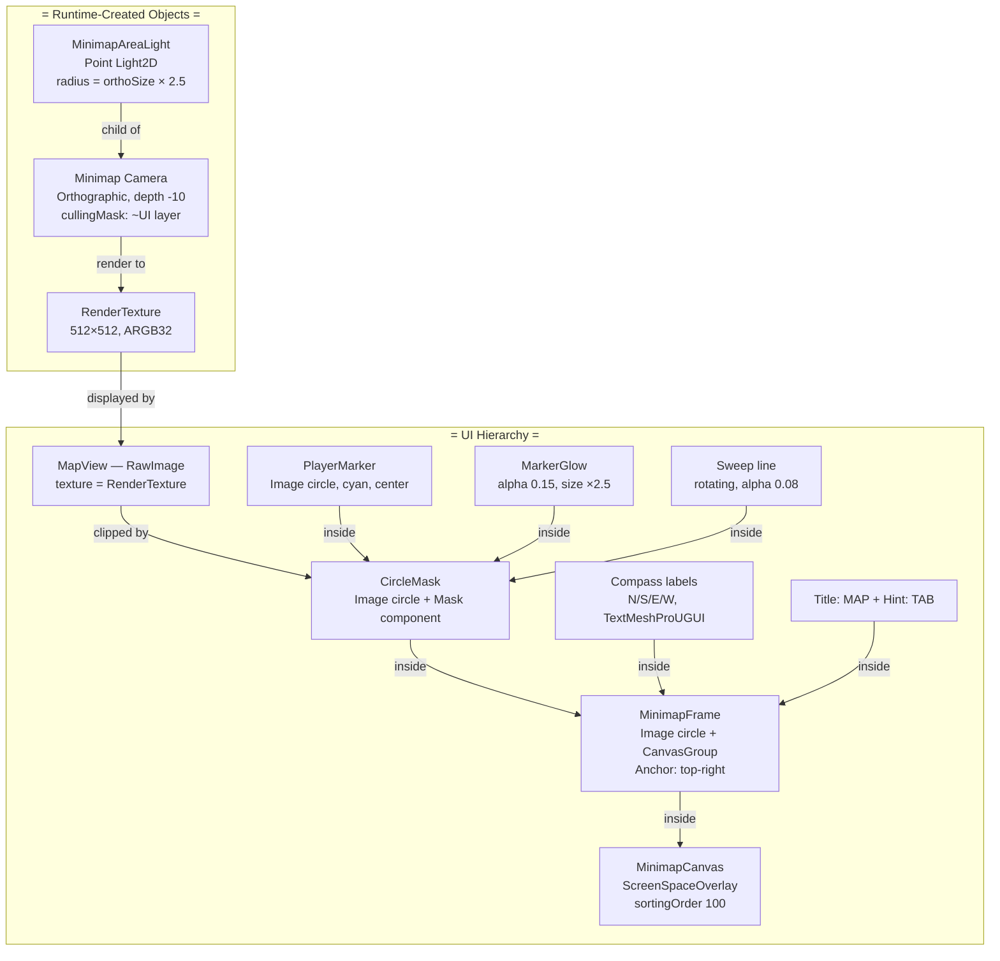
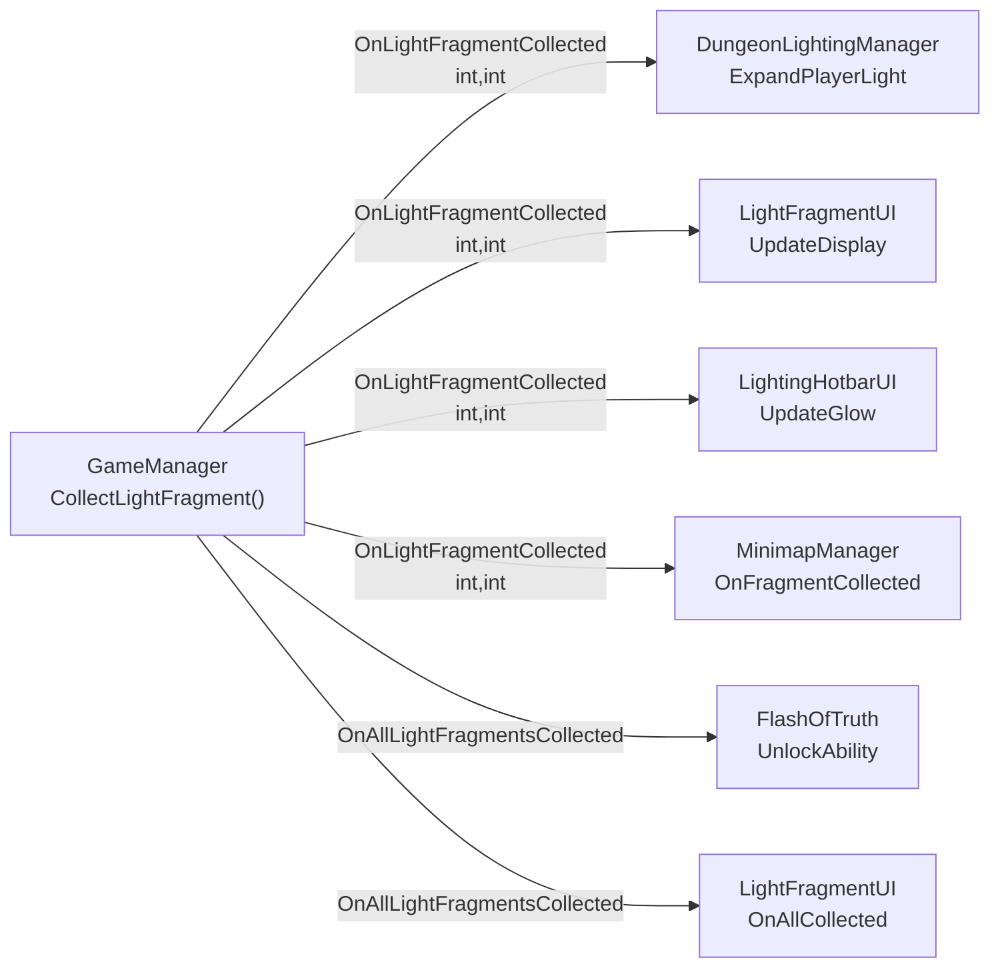

🧭 PHẦN 4: Minimap & GameManager — Review Chi Tiết Code

---

## 1. MinimapManager.cs — Minimap tròn

**File**: [MinimapManager.cs](file:///e:/%21FPT/7.SP26/PRU213/NoWayOut/Assets/Scripts/UI/MinimapManager.cs) (465 dòng)

### 1.1 Kiến trúc tổng quan



### 1.2 Initialization — Coroutine chờ Player

```csharp
private IEnumerator InitializeWhenReady()
{
    yield return null;  // Đợi 1 frame
    yield return null;  // Đợi 2 frame (để scene load xong)

    // Tìm player với timeout 5 giây
    float elapsed = 0f;
    while (playerTransform == null && elapsed < 5f)
    {
        var p = GameObject.FindGameObjectWithTag("Player");
        if (p != null) playerTransform = p.transform;
        else { yield return new WaitForSeconds(0.3f); elapsed += 0.3f; }
    }

    if (playerTransform == null)
    {
        Debug.LogWarning("[MinimapManager] Player not found, minimap disabled.");
        yield break; // Thoát coroutine, không tạo minimap
    }

    CreateRenderTexture();
    CreateMinimapCamera();
    CreateMinimapUI();
    isInitialized = true;
}
```

**Q**: _Tại sao dùng `yield return null` 2 lần ở đầu?_
→ Frame 1: [Awake()](file:///e:/%21FPT/7.SP26/PRU213/NoWayOut/Assets/Scripts/Core/RoomTransitionManager.cs#33-46) chạy xong cho tất cả objects. Frame 2: [Start()](file:///e:/%21FPT/7.SP26/PRU213/NoWayOut/Assets/Scripts/Core/DungeonLightingManager.cs#56-79) chạy xong. Đợi 2 frame đảm bảo Player đã được Instantiate + tag "Player" đã set.

**Q**: _`yield break` khác `return` trong coroutine thế nào?_
→ Trong coroutine (hàm `IEnumerator`), KHÔNG thể dùng `return;`. `yield break` là cách tương đương để kết thúc coroutine ngay lập tức.

### 1.3 RenderTexture — Tạo "vải" cho camera

```csharp
private void CreateRenderTexture()
{
    minimapRT = new RenderTexture(
        renderTextureSize,    // 512 pixels
        renderTextureSize,    // 512 pixels
        24,                   // depth buffer 24-bit (cho z-sorting)
        RenderTextureFormat.ARGB32  // RGBA 8-bit mỗi kênh
    );
    minimapRT.antiAliasing = 2;        // MSAA 2x (giảm jagged edges)
    minimapRT.filterMode = FilterMode.Bilinear; // Smooth khi scale
    minimapRT.Create();                // Cấp phát GPU memory
}
```

**Q**: _RenderTexture là gì? Tại sao camera cần nó?_
→ Mặc định Camera render lên màn hình. `targetTexture = renderTexture` → camera render vào texture trong GPU memory thay vì màn hình. Texture này hiển thị trên UI qua `RawImage`. Giống như "camera quay video vào một tấm canvas ảo".

**Q**: _Tại sao depth buffer 24-bit?_
→ Depth buffer lưu khoảng cách pixel tới camera → quyết định pixel nào vẽ trước/sau. 24-bit = đủ precision cho 2D (16-bit cũng đủ nhưng 24 là safe default). 0 = không depth → objects đè nhau sai thứ tự.

**Q**: _`minimapRT.Create()` — bắt buộc không?_
→ Có. `new RenderTexture()` chỉ tạo object C#. `.Create()` thực sự allocate bộ nhớ trên GPU. Nếu bỏ `.Create()` → render fail hoặc crash.

### 1.4 Minimap Camera — URP Config

```csharp
private void CreateMinimapCamera()
{
    minimapCamera = camObj.AddComponent<Camera>();
    minimapCamera.orthographic = true;           // 2D view, không perspective
    minimapCamera.orthographicSize = 25f;         // Thấy 25 world units theo chiều dọc
    minimapCamera.targetTexture = minimapRT;      // Render vào RenderTexture
    minimapCamera.clearFlags = CameraClearFlags.SolidColor;
    minimapCamera.backgroundColor = new Color(0.02f, 0.02f, 0.04f); // Nền tối
    minimapCamera.depth = -10;                    // Render TRƯỚC main camera
    minimapCamera.cullingMask = ~(1 << 5);        // Tất cả NGOẠI TRỪ layer 5 (UI)

    // URP: PHẢI thêm component này
    var urpData = camObj.AddComponent<UniversalAdditionalCameraData>();
    urpData.renderType = CameraRenderType.Base;   // Camera độc lập, không stack
}
```

**Q**: _`cullingMask = ~(1 << 5)` nghĩa là gì?_
→ Bitwise operations:

- `1 << 5` = `000...100000` = bit thứ 5 bật = layer 5 (UI)
- `~` = NOT = lật tất cả bit → `111...011111` = tất cả layers NGOẠI TRỪ layer 5
- Kết quả: minimap camera render mọi thứ trừ UI → không bị chồng text/buttons lên minimap.

**Q**: _`UniversalAdditionalCameraData` cần thiết không?_
→ **BẮT BUỘC** trong URP. Nếu không có → URP warning, camera có thể không render đúng (lighting bị sai, post-processing bị thiếu). `CameraRenderType.Base` = camera render độc lập, không phải overlay trên camera khác.

**Q**: _`depth = -10` — ý nghĩa?_
→ Camera có depth thấp hơn render trước. Main camera thường depth = 0. Minimap camera depth = -10 → render trước → RenderTexture sẵn sàng khi main camera render UI. Tuy nhiên vì minimap render vào texture riêng nên depth ở đây chủ yếu để tránh conflict.

### 1.5 Minimap Light — Tại sao cần?

```csharp
private void CreateMinimapLight(Transform parent)
{
    // Dùng POINT light, KHÔNG dùng Global
    minimapLight = lightObj.AddComponent<Light2D>();
    minimapLight.lightType = Light2D.LightType.Point;
    minimapLight.pointLightOuterRadius = cameraOrthoSize * 2.5f;  // 62.5 units
    minimapLight.pointLightInnerRadius = cameraOrthoSize * 1.5f;  // 37.5 units
    minimapLight.intensity = 0.35f;
    minimapLight.color = new Color(0.3f, 0.35f, 0.5f); // Xanh lạnh
    minimapLight.falloffIntensity = 0.3f;  // Fade chậm
}
```

**Q**: _Tại sao minimap cần light riêng? Main scene đã tối, minimap cũng tối chứ?_
→ ĐÚNG! Main scene có Global Light intensity 0.005 → dungeon tối đen. Minimap camera render cùng scene → cũng tối đen → không thấy gì. Thêm Point Light riêng gắn vào minimap camera → chiếu sáng khu vực minimap nhìn thấy.

**Q**: _Tại sao dùng Point Light thay vì Global Light cho minimap?_
→ Global Light ảnh hưởng TẤT CẢ cameras trong scene. Nếu thêm Global Light sáng → main scene cũng sáng → phá game horror. Point Light chỉ ảnh hưởng khu vực quanh minimap camera → main scene vẫn tối đen. Point Light di chuyển theo camera → luôn sáng đúng vùng player đang ở.

### 1.6 UI — Circle Mask

```csharp
// Circle Mask: clip RawImage thành hình tròn
var maskImg = maskObj.AddComponent<Image>();
maskImg.sprite = CreateCircleSprite(128);  // Tạo sprite tròn bằng code
var mask = maskObj.AddComponent<Mask>();
mask.showMaskGraphic = false;  // Ẩn mask image, chỉ dùng shape để clip
```

**Q**: _Unity Mask component hoạt động thế nào?_
→ `Mask` dùng alpha channel của `Image` làm stencil. Pixel có alpha > 0 → hiện children. Alpha = 0 → ẩn children. Circle sprite có alpha 1 bên trong, 0 bên ngoài → clip thành tròn.

**Q**: _`showMaskGraphic = false` — nếu true thì sao?_
→ `true` = hiện cả ảnh mask (circle trắng) lẫn nội dung. `false` = chỉ dùng shape để clip, không hiện mask image → thấy RawImage bên trong, không thấy circle trắng.

### 1.7 Procedural Circle Sprite

```csharp
private Sprite CreateCircleSprite(int res)
{
    if (_cachedCircle != null) return _cachedCircle; // Cache!

    var tex = new Texture2D(res, res, TextureFormat.RGBA32, false);
    float c = res * 0.5f;    // center = 64 (nếu res=128)
    float r = c - 1f;         // radius = 63 (trừ 1 pixel cho anti-alias)

    for (int y = 0; y < res; y++)
        for (int x = 0; x < res; x++)
        {
            float dist = Vector2.Distance(new Vector2(x, y), new Vector2(c, c));
            // Anti-aliased edge: alpha fade dần ở rìa
            tex.SetPixel(x, y, new Color(1, 1, 1, Mathf.Clamp01(r - dist + 0.5f)));
        }
    tex.Apply();  // Upload pixel data lên GPU

    _cachedCircle = Sprite.Create(tex, new Rect(0,0,res,res),
                                   new Vector2(0.5f, 0.5f), 100f);
    return _cachedCircle;
}
```

**Q**: _Tại sao tạo sprite bằng code thay vì import ảnh PNG?_
→ **Không phụ thuộc asset external**. Script tự tạo → drag-drop vào scene là chạy, không cần setup file ảnh. Đặc biệt hữu ích cho UI runtime-created (minimap, hotbar).

**Q**: _`Mathf.Clamp01(r - dist + 0.5f)` — công thức anti-alias?_
→ Tại rìa circle: `r - dist` = 0. Cộng 0.5 → alpha = 0.5 (semi-transparent). Bên trong: `r - dist` lớn → clamp về 1 (fully visible). Bên ngoài: `r - dist` âm → clamp về 0 (invisible). Kết quả: rìa circle smooth, không bị "răng cưa" (aliasing).

**Q**: _`_cachedCircle` static — tại sao cache?_
→ [CreateCircleSprite](file:///e:/%21FPT/7.SP26/PRU213/NoWayOut/Assets/Scripts/UI/MinimapManager.cs#355-374) được gọi nhiều lần (circle mask, player marker, glow...). Mỗi lần tạo Texture2D 128×128 = duyệt 16384 pixels. Cache tránh tạo lại → performance.

### 1.8 Camera Follow + Sweep

```csharp
private void Update()
{
    var kb = Keyboard.current;
    if (kb != null && kb.tabKey.wasPressedThisFrame) ToggleMinimap();

    if (!isInitialized || playerTransform == null) return;

    // Smooth follow
    UpdateCameraPosition();

    // Radar sweep rotation
    if (sweepRect != null)
        sweepRect.Rotate(0, 0, -25f * Time.deltaTime); // 25°/giây ngược chiều kim đồng hồ
}

private void UpdateCameraPosition()
{
    Vector3 target = new Vector3(
        playerTransform.position.x,
        playerTransform.position.y,
        -50f);  // Z = -50 (nhìn từ trên xuống)
    minimapCamera.transform.position = Vector3.Lerp(
        minimapCamera.transform.position, target,
        cameraSmoothSpeed * Time.deltaTime);  // Smooth follow
}
```

**Q**: _Tại sao camera Z = -50?_
→ 2D game dùng Z để quyết định rendering. Objects ở Z=0. Camera ở Z=-50 → nhìn xuống objects. Nếu Z=0 hoặc dương → camera cùng mặt phẳng hoặc phía sau objects → không thấy gì.

**Q**: _`Vector3.Lerp` với `Time.deltaTime` — tại sao smooth?_
→ Đây là **exponential damping**: mỗi frame di chuyển [(target - current) _ speed _ dt](file:///e:/%21FPT/7.SP26/PRU213/NoWayOut/Assets/Scripts/ProceduralGeneration/Core/Room.cs#37-50). Khi gần target → khoảng cách nhỏ → di chuyển chậm dần → animation mượt, không giật đột ngột. Khác biệt với linear Lerp dùng `t` tăng dần.

### 1.9 Fragment & Visibility API

```csharp
public void OnFragmentCollected(int totalFragments)
{
    // Mỗi fragment → minimap sáng hơn + rộng hơn
    minimapLight.intensity = minimapLightIntensity + totalFragments * 0.15f;
    // 0 frag: 0.35 → 1: 0.5 → 2: 0.65 → 3: 0.8
    minimapLight.pointLightOuterRadius = cameraOrthoSize * 2.5f + totalFragments * 5f;
    // 0 frag: 62.5 → 1: 67.5 → 2: 72.5 → 3: 77.5
}

public void RevealAllRooms()
{
    minimapLight.intensity = 1.0f;                     // Full brightness
    minimapLight.pointLightOuterRadius = cameraOrthoSize * 4f;  // Rất rộng
    minimapLight.pointLightInnerRadius = cameraOrthoSize * 3f;
}
```

### 1.10 Cleanup

```csharp
private void OnDestroy()
{
    if (minimapRT != null)
    {
        minimapRT.Release();   // Giải phóng GPU memory
        Destroy(minimapRT);    // Destroy Unity object
    }
}
```

**Q**: _Tại sao phải `Release()` trước [Destroy()](file:///e:/%21FPT/7.SP26/PRU213/NoWayOut/Assets/Scripts/UI/LightFragmentUI.cs#49-57)?_
→ `Release()` giải phóng GPU memory (VRAM). [Destroy()](file:///e:/%21FPT/7.SP26/PRU213/NoWayOut/Assets/Scripts/UI/LightFragmentUI.cs#49-57) chỉ xóa Unity managed object (C# side). Nếu chỉ Destroy → VRAM bị leak cho đến khi GC chạy. Gọi cả hai = explicit cleanup = best practice.

---

## 2. GameManager.cs — Quản lý trạng thái

**File**: [GameManager.cs](file:///e:/%21FPT/7.SP26/PRU213/NoWayOut/Assets/Scripts/Core/GameManager.cs) (232 dòng)

### 2.1 Singleton

```csharp
public sealed class GameManager : MonoBehaviour
{
    public static GameManager Instance { get; private set; }

    private void Awake()
    {
        if (Instance != null && Instance != this)
        {
            Destroy(gameObject);
            return;
        }
        Instance = this;
    }

    private void OnDestroy()
    {
        if (Instance == this) Instance = null; // Cleanup
    }
}
```

**Q**: _`sealed` keyword trên class có ý nghĩa gì?_
→ `sealed` = không cho phép class khác kế thừa [GameManager](file:///e:/%21FPT/7.SP26/PRU213/NoWayOut/Assets/Scripts/Core/GameManager.cs#9-231). Singleton không nên bị override → `sealed` ngăn programmer tạo class con gây conflict.

**Q**: _[OnDestroy](file:///e:/%21FPT/7.SP26/PRU213/NoWayOut/Assets/Scripts/UI/LightFragmentUI.cs#49-57) set `Instance = null` — tại sao cần?_
→ Nếu không null → sau khi scene unload, `Instance` trỏ đến object đã bị Destroy → `NullReferenceException` khi access. Check `if (Instance == this)` tránh null instance bị ghi đè bởi GameManager mới đang tạo.

### 2.2 Auto-Create Pattern

```csharp
private void Awake()
{
    // ...singleton setup...

    // Auto-create LightFragmentUI nếu chưa có
    if (FindFirstObjectByType<LightFragmentUI>() == null)
    {
        var uiObj = new GameObject("LightFragmentUI");
        uiObj.AddComponent<LightFragmentUI>();
    }

    // Auto-create FlashOfTruthUI nếu chưa có
    if (FindFirstObjectByType<FlashOfTruthUI>() == null)
    {
        var flashUIObj = new GameObject("FlashOfTruthUI");
        flashUIObj.AddComponent<FlashOfTruthUI>();
    }

    // Auto-create DungeonLightingManager
    if (FindFirstObjectByType<DungeonLightingManager>() == null)
    {
        var obj = new GameObject("DungeonLightingManager");
        obj.AddComponent<DungeonLightingManager>();
    }

    // Auto-create MinimapManager
    if (FindFirstObjectByType<UI.MinimapManager>() == null)
    {
        var obj = new GameObject("MinimapManager");
        obj.AddComponent<UI.MinimapManager>();
    }

    // Auto-create LightingHotbarUI
    if (FindFirstObjectByType<UI.LightingHotbarUI>() == null)
    {
        var obj = new GameObject("LightingHotbarUI");
        obj.AddComponent<UI.LightingHotbarUI>();
    }
}
```

**Q**: _Tại sao auto-create thay vì bắt buộc drag-drop trong scene?_
→ **Fail-safe design**: Dù designer quên add component vào scene, game vẫn chạy. Mỗi component tự tạo UI/visual khi chưa có references → giảm human error. Tuy nhiên, `FindFirstObjectByType` trong Awake tốn performance → chỉ chấp nhận được khi gọi 1 lần lúc start.

**Q**: _5 lần `FindFirstObjectByType` trong Awake — có vấn đề gì?_
→ `FindFirstObjectByType` quét toàn bộ scene → **O(n) mỗi lần**. 5 lần = 5 lần quét. Phòng nhiều objects → chậm. Giải pháp tốt hơn: gộp vào 1 pass hoặc dùng `[RequireComponent]`. Tuy nhiên vì chỉ gọi 1 lần lúc start → chấp nhận được.

### 2.3 Event System

```csharp
// 2 events chính
public event System.Action<int, int> OnLightFragmentCollected;
public event System.Action OnAllLightFragmentsCollected;

// SUBSCRIBE (trong Start() của các script khác):
GameManager.Instance.OnLightFragmentCollected += OnFragmentCollected;

// FIRE:
public void CollectLightFragment(int fragmentID)
{
    lightFragmentsCollected++;
    OnLightFragmentCollected?.Invoke(lightFragmentsCollected, totalLightFragments);

    if (lightFragmentsCollected >= totalLightFragments)
        OnAllFragmentsCollected();
}

private void OnAllFragmentsCollected()
{
    OnAllLightFragmentsCollected?.Invoke();
}

// UNSUBSCRIBE (trong OnDestroy() của script):
GameManager.Instance.OnLightFragmentCollected -= OnFragmentCollected;
```

**Q**: _`event` keyword có tác dụng gì so với plain `Action`?_
→ `event` hạn chế: chỉ class chứa event mới được gọi `.Invoke()`. Bên ngoài chỉ được `+=` (subscribe) và `-=` (unsubscribe). Nếu không có `event` → bất kỳ script nào cũng fire event → gây bug khó tìm.

**Q**: _`?.Invoke()` — null-conditional operator?_
→ Nếu không có subscriber nào → event = null. `?.Invoke()` = chỉ gọi nếu không null. Nếu viết `OnAllLightFragmentsCollected()` trực tiếp mà không có subscriber → `NullReferenceException`.

**Q**: _Tại sao phải Unsubscribe trong [OnDestroy](file:///e:/%21FPT/7.SP26/PRU213/NoWayOut/Assets/Scripts/UI/LightFragmentUI.cs#49-57)?_
→ Nếu không unsubscribe → delegate vẫn giữ reference đến object đã Destroy → **memory leak** + **MissingReferenceException** khi event fire. Đây là **quy tắc bắt buộc**: subscribe trong Start → unsubscribe trong OnDestroy.

### 2.4 Các subscriber nhận event



### 2.5 Game Over & Restart

```csharp
public void TriggerGameOver()
{
    if (isGameOver) return;  // Guard: gọi nhiều lần không sao
    isGameOver = true;
    Time.timeScale = 0f;     // ĐÓNG BĂNG game (Update vẫn chạy nhưng Time.deltaTime=0)
    gameOverUI.SetActive(true);
}

public void RestartGame()
{
    Time.timeScale = 1f;     // Resume game
    isGameOver = false;
    gameOverUI.SetActive(false);

    // Auto-save trước khi reset
    if (SaveManager.Instance != null)
        SaveManager.Instance.SaveGame();

    // THÔNG MINH: Thử regenerate map KHÔNG cần reload scene
    var mapManager = FindFirstObjectByType<Dungeon.MapInitializationManager>();
    if (mapManager != null)
    {
        mapManager.RegenerateWithNewSeed();  // Tạo dungeon mới ngay
        return;
    }

    // Fallback legacy system
    var legacyBuilder = FindFirstObjectByType<Dungeon.UnityDungeonTilemapBuilder>();
    if (legacyBuilder != null)
    {
        legacyBuilder.RegenerateWithNewSeed();
        return;
    }

    // Last resort: reload scene
    SceneManager.LoadScene(SceneManager.GetActiveScene().name);
}
```

**Q**: _`Time.timeScale = 0` dừng những gì?_
→ Dừng: `Time.deltaTime` = 0, physics, animations (nếu dùng Scaled time), `WaitForSeconds`, particle systems. KHÔNG dừng: [Update()](file:///e:/%21FPT/7.SP26/PRU213/NoWayOut/Assets/Scripts/Items/LightFragment.cs#83-102) vẫn chạy (chỉ là deltaTime=0), `Time.unscaledDeltaTime` vẫn tính, `WaitForSecondsRealtime`. UI animations cần `unscaledDeltaTime` để vẫn chạy khi pause.

**Q**: _Tại sao thử regenerate trước khi reload scene?_
→ Reload scene = **chậm** (load assets, re-instantiate everything, lag spike). Regenerate in-place = xóa dungeon cũ + tạo mới cùng scene = **nhanh**, trải nghiệm mượt hơn. Fallback reload scene là safety net.

**Q**: _`#pragma warning disable CS0618` dùng để làm gì?_

```csharp
#pragma warning disable CS0618  // Suppress obsolete warning
var legacyBuilder = FindFirstObjectByType<UnityDungeonTilemapBuilder>();
#pragma warning restore CS0618  // Re-enable warning
```

→ `CS0618` = warning khi dùng API/class đánh dấu `[Obsolete]`. `UnityDungeonTilemapBuilder` đã deprecated nhưng vẫn cần cho backward compatibility. `#pragma warning disable/restore` = tắt warning vùng nhỏ, không ảnh hưởng toàn project.

### 2.6 Progression & Ending Integration

GameManager tích hợp với hệ thống progression run mới:

```csharp
// Auto-create DungeonRunProgressionManager nếu chưa có
if (FindFirstObjectByType<DungeonRunProgressionManager>() == null)
{
    var progObj = new GameObject("DungeonRunProgressionManager");
    progObj.AddComponent<DungeonRunProgressionManager>();
}

// Auto-create SaveManager
if (SaveManager.Instance == null && FindFirstObjectByType<SaveManager>() == null)
{
    var saveObj = new GameObject("SaveManager");
    saveObj.AddComponent<SaveManager>();
}
```

Khi player hoàn thành run (qua portal ở map 3-5):

```csharp
// DungeonRunProgressionManager.HandleRunFinished()
bool finished = HandleRunFinished();

if (finished)
{
    // Ending scene được load bởi SceneLoader
    // Good Ending: nếu mở đủ 3/3 chests
    // Bad Ending: nếu mở < 3/3 chests
    // SaveManager tự reset progression state cho run tiếp theo
}
```

**Liên kết save/load:**

Khi load game (Continue):

- SaveManager khôi phục `runCurrentRound`, `runCurrentMap`, `runOpenedGoalChestMask`
- DungeonRunProgressionManager nhận state từ SaveData
- Map được regenerate với đúng seed cũ
- Player spawn tại map anchor đã lưu

**Q**: _GameManager quản lý gì khác ngoài Light Fragments?_
→ GameManager là **central hub** auto-create tất cả major managers (Progression, Save, Lighting, Minimap, UI, ...). Khi scene load, GameManager Awake trước → tạo sẵn hệ thống cần thiết → các component khác chỉ cần FindFirstObjectByType để tìm.

---

## 3. SceneLoader.cs — Async Scene Management

**File**: [SceneLoader.cs](file:///e:/%21FPT/7.SP26/PRU213/NoWayOut/Assets/Scripts/Core/SceneLoader.cs) (150+ dòng)

### 3.1 Singleton & DontDestroyOnLoad

```csharp
public sealed class SceneLoader : MonoBehaviour
{
    private static SceneLoader _instance;

    public static void LoadScene(string sceneName)
    {
        EnsureInstance();
        _instance.StartCoroutine(_instance.LoadSceneCoroutine(sceneName));
    }

    private static void EnsureInstance()
    {
        if (_instance != null) return;

        var go = new GameObject("SceneLoader");
        _instance = go.AddComponent<SceneLoader>();
        DontDestroyOnLoad(go);  // ← Tồn tại xuyên scene transitions
    }
}
```

**Q**: _Tại sao SceneLoader cần `DontDestroyOnLoad`?_
→ Khi chuyển scene, Unity unload scene cũ → destroy tất cả objects. Nếu SceneLoader ở scene cũ → bị destroy, không kịp load scene mới. `DontDestroyOnLoad` giữ SceneLoader sống qua transitions → có thể load multiple scenes liên tiếp.

### 3.2 Async Loading Flow

```csharp
private IEnumerator LoadSceneCoroutine(string sceneName)
{
    BuildUiIfNeeded();  // Tạo loading canvas nếu chưa có
    _isLoadingScene = true;
    SetUiVisible(true);
    SetProgress(0f);

    // Async load scene
    var op = SceneManager.LoadSceneAsync(sceneName, LoadSceneMode.Single);
    op.allowSceneActivation = false;  // Đợi chúng ta bảo mới activate

    // Track progress 0 → 0.9
    while (op.progress < 0.9f)
    {
        SetProgress(op.progress / 0.9f);
        yield return null;  // Wait next frame
    }

    // Show 100% mới activate scene
    SetProgress(1f);
    yield return new WaitForSecondsRealtime(minVisibleSeconds); // Giữ loading UI tối thiểu 0.4s

    op.allowSceneActivation = true;  // Thực hiện scene activation
    while (!op.isDone) yield return null;  // Chờ scene fully activate

    _isLoadingScene = false;
    if (_blockCount <= 0)
        SetUiVisible(false);
}
```

**Q**: _`allowSceneActivation = false` — tại sao cần?_
→ Mặc định scene load xong liền activate (unload cũ, load mới, initialize). Với `allowSceneActivation = false` → scene load sẵn nhưng chưa activate → ta có thể hiện loading UI/animation trước khi bật scene mới.

**Q**: _`op.progress` đạt 0.9 rồi lại set 1.0 — tại sao không tự động?_
→ Unity `LoadSceneAsync.progress` chỉ đạt 0.9 (đó là 90% load), 10% còn lại là scene initialization sau activation. Nên set progress tới 1.0 theo manual timing.

### 3.3 Blocking Mode — Xử lý work sau load

Khi load ending scene, game cần thời gian apply save data / setup ending UI:

```csharp
// Khi chuyển đến ending scene
SceneLoader.BeginBlocking("Loading Ending...");
yield return new WaitForSeconds(1f);  // Apply save data, setup UI
SceneLoader.EndBlocking();  // Ẩn loading overlay
```

**Q**: _`BeginBlocking` / `EndBlocking` làm gì khác với thường?_
→ Thường: load scene xong → ẩn loading UI. Blocking mode: load scene xong → **GIỮ loading UI hiện**, cho code kịp apply dữ liệu. Gọi `EndBlocking()` mới ẩn.

---

## 4. UI Scripts — Auto-Created Components

### 4.1 LightFragmentUI.cs (261 dòng)

**Vị trí UI**: Top-right corner — hiện "✦ 1/3"

```csharp
// Event handling
GameManager.Instance.OnLightFragmentCollected += OnFragmentCollected;
GameManager.Instance.OnAllLightFragmentsCollected += OnAllCollected;

private void OnFragmentCollected(int current, int total)
{
    UpdateDisplay(current, total);          // "✦ 2/3"
    ShowNotification("Light Fragment 2/3"); // Center-top popup
    StartCoroutine(PulseEffect());          // Scale 1.0 → 1.3 → 1.0
}

private void OnAllCollected()
{
    allCollected = true;
    fragmentCountText.color = completeColor; // Xanh lá
    ShowNotification("All Fragments Collected!\nFlash of Truth Unlocked!");
}
```

**Pulse khi chưa thu thập đủ:**

```csharp
// Sin wave alpha: 0.4 → 1.0 → 0.4 → ...
float alpha = 0.7f + 0.3f * Mathf.Sin(Time.time * pulseSpeed);
fragmentCountText.alpha = alpha;
```

**Notification tự fade:**

```csharp
if (notificationTimer <= 0.5f)
    notificationGroup.alpha = notificationTimer / 0.5f; // Fade out trong 0.5s cuối
```

### 4.2 FlashOfTruthUI.cs (208 dòng)

**Vị trí UI**: Bottom-left corner — radial cooldown circle

```csharp
// Radial fill cooldown
cooldownFillImage.type = Image.Type.Filled;
cooldownFillImage.fillMethod = Image.FillMethod.Radial360;
cooldownFillImage.fillOrigin = (int)Image.Origin360.Top;  // Bắt đầu từ 12h
cooldownFillImage.fillClockwise = true;

// Mỗi frame update fill amount
cooldownFillImage.fillAmount = flashAbility.CooldownProgress; // 0 → 1

// Text states:
if (!flashAbility.IsUnlocked)      → "LOCKED"
else if (flashAbility.IsFlashActive) → "ACTIVE!"
else if (flashAbility.IsOnCooldown)  → "12.5s" (remaining)
else                                  → "READY"
```

**Q**: _`Image.FillMethod.Radial360` hoạt động thế nào?_
→ Vẽ image theo hình quạt 360°. `fillAmount = 0.5` → bán nguyệt. `fillAmount = 1.0` → tròn đầy. `fillOrigin = Top` → bắt đầu từ đỉnh (12h). Dùng cho circular cooldown indicator.

### 4.3 LightingHotbarUI.cs (410 dòng)

**Vị trí UI**: Bottom-right corner — 5 slot items

```csharp
// Slot chọn bằng phím 1-5 hoặc mouse wheel
Key key = Key.Digit1 + i;  // Key.Digit1 + 0 = Digit1, + 1 = Digit2...
if (keyboard[key].wasPressedThisFrame) SelectSlot(i);

// Mouse wheel
float scroll = mouse.scroll.ReadValue().y;
if (scroll > 0.1f)  SelectSlot((selectedSlot - 1 + slotCount) % slotCount); // Scroll up
if (scroll < -0.1f) SelectSlot((selectedSlot + 1) % slotCount);             // Scroll down
```

**Q**: _[(selectedSlot - 1 + slotCount) % slotCount](file:///e:/%21FPT/7.SP26/PRU213/NoWayOut/Assets/Scripts/ProceduralGeneration/Core/Room.cs#37-50) — tại sao cộng slotCount?_
→ Nếu `selectedSlot = 0` → `0 - 1 = -1`. `-1 % 5 = -1` trong C# (không wrap). Cộng `slotCount` trước: `0 - 1 + 5 = 4`. `4 % 5 = 4` → wrap đúng đến slot cuối.

**Glow integration với lighting:**

```csharp
private void OnFragmentCollected(int current, int total)
{
    // targetGlowLevel tăng dần theo fragments
    targetGlowLevel = Mathf.Lerp(baseGlowIntensity, maxGlowIntensity,
        (float)current / Mathf.Max(1, total));
    // 0 frag: 0.1 → 1: 0.267 → 2: 0.433 → 3: 0.6

    StartCoroutine(FlashGlow()); // Flash sáng tức thì rồi fade về
}

private void UpdateGlowAnimation()
{
    currentGlowLevel = Mathf.Lerp(currentGlowLevel, targetGlowLevel, Time.deltaTime * 2f);
    float pulse = 1f + Mathf.Sin(Time.time * glowPulseSpeed) * 0.15f;
    float finalGlow = currentGlowLevel * pulse;

    // Selected slot glow mạnh hơn x1.5
    float slotGlow = (i == selectedSlot) ? finalGlow * 1.5f : finalGlow;
    slotGlows[i].color = new Color(r, g, b, slotGlow);
}
```

---

## ❓ Câu Hỏi Review — Phần 4

**Q1**: Minimap dùng kỹ thuật gì để hiển thị scene thực?

> Camera thứ hai render vào RenderTexture. UI dùng RawImage hiển thị texture, clip bằng Circle Mask. Player marker luôn ở giữa vì camera follow player.

**Q2**: Tại sao minimap cần Point Light riêng?

> Main scene tối đen (Global Light 0.005). Minimap camera render cùng scene → cũng tối. Point Light riêng chiếu sáng chỉ vùng minimap nhìn, không ảnh hưởng main camera.

**Q3**: `cullingMask = ~(1 << 5)` nghĩa gì?

> Bitwise NOT + shift: tạo mask bao gồm tất cả layers NGOẠI TRỪ layer 5 (UI). Minimap không render UI elements.

**Q4**: Circle Mask tạo bằng code hay import ảnh?

> Tạo bằng code: [CreateCircleSprite()](file:///e:/%21FPT/7.SP26/PRU213/NoWayOut/Assets/Scripts/UI/MinimapManager.cs#355-374) duyệt pixels, tính distance → alpha. Cache static tránh tạo lại. Ưu điểm: không phụ thuộc external asset.

**Q5**: RenderTexture cần `Release()` không? Tại sao?

> CÓ. `Release()` giải phóng GPU VRAM. Chỉ [Destroy()](file:///e:/%21FPT/7.SP26/PRU213/NoWayOut/Assets/Scripts/UI/LightFragmentUI.cs#49-57) = C# object bị xóa nhưng VRAM leak cho đến GC. Best practice: gọi cả hai.

**Q6**: GameManager dùng `sealed` keyword — ý nghĩa?

> Ngăn class khác kế thừa. Singleton không nên bị override. `sealed` = compile-time safety.

**Q7**: Event `Action<int,int>` khác `UnityEvent` thế nào?

> `Action` = code-only, subscribe trong code. `UnityEvent` = serialize trong Inspector, drag-drop. GameManager dùng `Action` vì subscribers là các scripts, không cần Inspector config.

**Q8**: Tại sao phải unsubscribe event trong OnDestroy?

> Subscriber bị Destroy nhưng delegate vẫn giữ reference → `MissingReferenceException` khi event fire + memory leak. PHẢI `-=` trong OnDestroy.

**Q9**: `Time.timeScale = 0` dừng những gì?

> Dừng: deltaTime, physics, WaitForSeconds, particle, animations. KHÔNG dừng: Update() (chạy nhưng deltaTime=0), unscaledDeltaTime, WaitForSecondsRealtime.

**Q10**: RestartGame thử regenerate trước khi reload scene — tại sao?

> Regenerate in-place nhanh hơn reload scene (không cần load assets lại). Reload scene là fallback nếu không tìm thấy dungeon manager.

**Q11**: `UniversalAdditionalCameraData` bắt buộc trong URP không?

> CÓ. Camera trong URP cần component này để render đúng (lighting, post-processing). Thiếu = warning + render bị sai.

**Q12**: Auto-create pattern: ưu và nhược?

> **Ưu**: Fail-safe, game luôn chạy dù designer quên. **Nhược**: `FindFirstObjectByType` × 5 lần trong Awake = chậm. Component tạo runtime không hiện trong Inspector hierarchy ban đầu → khó debug.

**Q13**: [(selectedSlot - 1 + slotCount) % slotCount](file:///e:/%21FPT/7.SP26/PRU213/NoWayOut/Assets/Scripts/ProceduralGeneration/Core/Room.cs#37-50) — giải thích wrap-around?

> C# modulo cho số âm trả kết quả âm (-1 % 5 = -1). Cộng slotCount trước đảm bảo luôn dương → wrap đúng: slot 0 scroll up → slot 4.

**Q14**: Radial360 fillMethod dùng cho gì?

> Vẽ image theo hình quạt tròn. fillAmount 0→1 = quạt mở dần 360°. Dùng cho cooldown indicator tròn của Flash of Truth.

**Q15**: Minimap camera `orthographicSize = 25` — player thấy bao nhiêu?

> orthographicSize = nửa chiều cao visible. Camera thấy 25×2 = 50 world units chiều dọc, và 50×(screenWidth/screenHeight) chiều ngang. Phòng 15×15 → thấy khoảng 3 phòng.

**Q16**: `cameraSmoothSpeed * Time.deltaTime` trong Lerp — kỹ thuật gì?

> **Exponential damping**: mỗi frame di chuyển tỷ lệ với khoảng cách còn lại. Gần target → chậm dần → mượt. Khác linear Lerp (tăng t đều → tốc độ đều).

---

## ❓ Phần 5: Progression & Ending Integration (Mới)

**Q17**: GameManager auto-create những component nào liên quan tới progression?

> `DungeonRunProgressionManager` (quản lý run 3×5 maps), `SaveManager` (save/load state), và các UI như `MinimapManager`, `DungeonLightingManager`. Tất cả auto-create trong Awake() để đảm bảo game chạy ngay dù designer quên setup.

**Q18**: Khi player qua portal ở map 3-5, luồng chuyển ending thế nào?

> 1. `GoalPortal.TryAdvanceToNextMap()` gọi `DungeonRunProgressionManager.TryAdvanceToNextMap()`.
> 2. Kiểm tra là map cuối run → gọi `HandleRunFinished()`.
> 3. `HandleRunFinished()` chọn ending scene dựa theo `openedGoalChestCount`:
>    - `>= totalGoalChests` → `goodEndingSceneName`
>    - `< totalGoalChests` → `badEndingSceneName`
> 4. Gọi `SceneLoader.LoadScene(endingScene)` → async load + show loading UI.

**Q19**: `DontDestroyOnLoad` trong SceneLoader — tại sao cần?

> SceneLoader xuyên suốt tất cả scene transitions. Khi chuyển scene, Unity unload scene cũ → destroy tất cả objects. `DontDestroyOnLoad` giữ SceneLoader sống → có thể load multiple scenes liên tiếp. Nếu không → SceneLoader sẽ bị hủy trước khi load scene mới.

**Q20**: `LoadSceneAsync` với `allowSceneActivation = false` — lợi ích?

> Mặc định load xong → activate ngay. Với `false` → load sẵn nhưng chưa activate → ta hiển thị loading UI an toàn trước khi "bật" scene mới. Điều này tránh hiện tượng UI lag khi scene activate.

**Q21**: Khi load ending scene, làm sao ensure UI setup xong trước khi player nhìn thấy?

> Dùng `SceneLoader.BeginBlocking("message")` → load scene (UI ẩn đi), rồi apply dữ liệu ending (progress, chest count, ...), cuối cùng gọi `EndBlocking()` → show scene. `BeginBlocking/EndBlocking` giữ loading overlay để player đợi.

**Q22**: Save/load progression state liên quan tới những dữ liệu nào?

> - `runCurrentRound`, `runCurrentMap`: vị trí hiện tại trong run.
> - `runOpenedGoalChestMask`: bitmask những chest đã mở (không cho farm lại).
> - `hasDungeonSeed`, `dungeonSeed`: seed map để continue ra đúng layout.
> - `mapAnchor`: vị trí world của Respawn_Point → continue ở đúng chỗ cũ.
> - `runCurrentMapCompleted`: map đã clear → portal/chest phải hiện lên.

**Q23**: Tại sao restart game tự động save trước khi reset?

> Khi player chọn Restart trong Game Over UI, gọi `GameManager.RestartGame()` → `SaveManager.SaveGame()` → lưu toàn bộ state (HP, position, progression, ...) → sau đó regenerate dungeon. Mục đích: nếu user quit giữa chừng → load lại đúng tiến trình.

**Q24**: Ending scene có tương tác gì với progression system?

> Ending scene là **terminal state** của run. Nó có thể:
>
> - Hiển thị số lượng chest đã mở (từ `openedGoalChestCount`).
> - Phát ending animation/music khác nhau tùy good/bad.
> - Cung cấp nút "Return to Menu" (reset progression) hoặc "New Run" (bắt đầu run mới).

**Q25**: `allowSceneActivation = true` sau khi `SetProgress(1f)` — tại sao không ngay?

> Nếu activate ngay khi progress 0.9 → có lag spike (Unity cần initialize scene objects, scripts, ...). Chờ `minVisibleSeconds` (0.4s) → loading overlay an toàn, player không bị sốc hình ảnh → rồi activate → trình tự mượt. Đây là UX best practice cho async loading.
