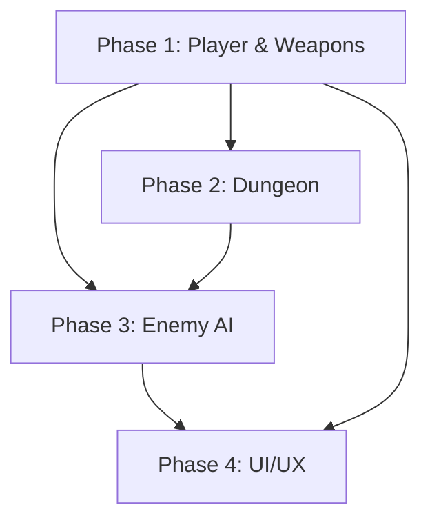

# 🗺️ SOUL KNIGHT CLONE - ROADMAP & DOCUMENTATION

## 📖 TÀI LIỆU HƯỚNG DẪN

### 🎯 File chính
- **[SETUP_GUIDE.md](../SETUP_GUIDE.md)**: Tổng quan dự án và quick start
- **[README.md](../README.md)**: Thông tin chung về project

### 📚 Hướng dẫn chi tiết theo giai đoạn

| # | Giai đoạn | File | Trạng thái | Ước tính |
|---|-----------|------|------------|----------|
| 1️⃣ | **Player & Weapon System** | [PHASE_1_SETUP_GUIDE.md](PHASE_1_SETUP_GUIDE.md) | ✅ Hoàn thành | 2-3 giờ |
| 2️⃣ | **Dungeon Generation** | [PHASE_2_DUNGEON_GENERATION.md](PHASE_2_DUNGEON_GENERATION.md) | 🚧 Template | 3-4 giờ |
| 3️⃣ | **Enemy AI System** | [PHASE_3_ENEMY_AI.md](PHASE_3_ENEMY_AI.md) | 🚧 Template | 4-5 giờ |
| 4️⃣ | **UI/UX System** | [PHASE_4_UI_SYSTEM.md](PHASE_4_UI_SYSTEM.md) | 🚧 Template | 2-3 giờ |

**Tổng thời gian ước tính**: 11-15 giờ

---

## 🎮 GIAI ĐOẠN 1: PLAYER & WEAPON SYSTEM ✅

### Đã triển khai
- [x] Core Systems (GameManager, ObjectPooler, Constants)
- [x] PlayerController (8-way movement, Dash với I-frames)
- [x] PlayerStats (Health, Armor tự hồi, Energy)
- [x] Weapon System (ScriptableObject-based)
- [x] Projectile với Object Pooling
- [x] Camera System với Cinemachine
- [x] Input System integration (PC + Controller)

### Scripts đã tạo (8 files)
```
Core/
├─ GameManager.cs
├─ ObjectPooler.cs
├─ GameConstants.cs
└─ CameraShaker.cs

Player/
├─ PlayerController.cs
├─ PlayerStats.cs
└─ PlayerInputHandler.cs

Weapons/
├─ WeaponData.cs
├─ WeaponController.cs
└─ Projectile.cs
```

### Hướng dẫn
📖 **[Xem hướng dẫn Unity chi tiết](PHASE_1_SETUP_GUIDE.md)** (9 bước setup từng bước)

---

## 🗺️ GIAI ĐOẠN 2: DUNGEON GENERATION 🚧

### Sẽ triển khai
- [ ] Procedural Generation Algorithm (Random Walk)
- [ ] Room System (Start, Combat, Treasure, Boss)
- [ ] Tilemap Integration (Walls, Floors)
- [ ] Door System (auto-close với enemies)
- [ ] Destructible Objects (Barrels, Crates)
- [ ] Minimap System

### Scripts cần tạo (6 files)
```
Dungeon/
├─ DungeonGenerator.cs
├─ Room.cs
├─ RoomTemplates.cs
├─ DoorController.cs
├─ DestructibleObject.cs
└─ MinimapController.cs
```

### Để bắt đầu
🗣️ Nói: **"Triển khai Giai đoạn 2: Dungeon Generation"**

---

## 🤖 GIAI ĐOẠN 3: ENEMY AI SYSTEM 🚧

### Sẽ triển khai
- [ ] Finite State Machine (FSM)
- [ ] AI States (Idle, Wander, Chase, Attack, Death)
- [ ] Pathfinding System (A* hoặc Simple Follow)
- [ ] Enemy Stats & Health
- [ ] Loot Drop System
- [ ] Multiple Enemy Types

### Scripts cần tạo (10+ files)
```
Enemies/
├─ EnemyController.cs
├─ EnemyStats.cs
├─ EnemyStateMachine.cs
├─ States/
│  ├─ IdleState.cs
│  ├─ WanderState.cs
│  ├─ ChaseState.cs
│  ├─ AttackState.cs
│  └─ DeathState.cs
├─ EnemyTypes/
│  ├─ MeleeEnemy.cs
│  ├─ RangedEnemy.cs
│  └─ BossEnemy.cs
└─ LootDropper.cs
```

### Để bắt đầu
🗣️ Nói: **"Triển khai Giai đoạn 3: Enemy AI"**

---

## 🎨 GIAI ĐOẠN 4: UI/UX SYSTEM 🚧

### Sẽ triển khai
- [ ] HUD (Health/Armor/Energy bars)
- [ ] Weapon Icon Display
- [ ] Damage Numbers (Floating Text)
- [ ] Minimap UI
- [ ] Pause Menu
- [ ] Game Over / Victory Screen

### Scripts cần tạo (8 files)
```
UI/
├─ HUDController.cs
├─ HealthBarUI.cs
├─ ArmorBarUI.cs
├─ EnergyBarUI.cs
├─ WeaponIconUI.cs
├─ DamageNumberSpawner.cs
├─ PauseMenuController.cs
└─ MinimapUI.cs
```

### Để bắt đầu
🗣️ Nói: **"Triển khai Giai đoạn 4: UI System"**

---

## 📊 TIẾN ĐỘ TỔNG QUAN

```
Phase 1: ████████████████████ 100% ✅
Phase 2: ░░░░░░░░░░░░░░░░░░░░   0% 🚧
Phase 3: ░░░░░░░░░░░░░░░░░░░░   0% 🚧
Phase 4: ░░░░░░░░░░░░░░░░░░░░   0% 🚧
─────────────────────────────────────
Overall: █████░░░░░░░░░░░░░░░  25%
```

---

## 🎯 DEPENDENCIES



**Khuyến nghị**: Làm theo thứ tự 1 → 2 → 3 → 4

---

## 💡 TIPS & BEST PRACTICES

### Khi làm Giai đoạn 2 (Dungeon)
- Bắt đầu với thuật toán đơn giản (Random Walk) trước khi optimize
- Test từng room type riêng lẻ
- Sử dụng Rule Tiles của Unity cho wall auto-tiling

### Khi làm Giai đoạn 3 (Enemy AI)
- Triển khai FSM đơn giản trước (Idle → Chase → Attack)
- Test pathfinding với 1 enemy trước khi spawn nhiều
- Cân bằng stats sau khi có đủ enemy types

### Khi làm Giai đoạn 4 (UI)
- Dùng TextMeshPro thay vì Text component
- Implement Events từ PlayerStats để update UI
- Làm Pixel Art UI cho phù hợp với Soul Knight style

---

## 🔧 CÔNG CỤ & ASSETS KHUYÊN DÙNG

### Unity Packages
- ✅ Input System (đã cài)
- ✅ Cinemachine (đã cài)
- ✅ 2D Tilemap Editor (đã cài)
- 🔲 ProBuilder (optional - cho level design nhanh)
- 🔲 NavMesh Components (nếu dùng NavMesh thay vì A*)

### Free Assets
- **Tileset**: Itch.io → "Dungeon Tileset" by 0x72
- **Characters**: Itch.io → "Tiny Swords" sprite pack
- **SFX**: Freesound.org → "8-bit gunshot"
- **UI**: Kenney.nl → "UI Pack"

---

## 📞 SUPPORT & TROUBLESHOOTING

### Gặp vấn đề?
1. Kiểm tra file hướng dẫn tương ứng
2. Xem phần Troubleshooting trong mỗi Phase
3. Kiểm tra Console errors trong Unity
4. Verify script references trong Inspector

### Debug Mode
Mỗi giai đoạn có debug visualization:
- **Phase 1**: Gizmos line từ Player tới chuột
- **Phase 2**: Room bounds và connections
- **Phase 3**: Enemy detection radius
- **Phase 4**: UI anchor points

---

## 📝 CHANGELOG

### v0.1.0 - Giai đoạn 1 (Current)
- ✅ Tạo 10 script core systems
- ✅ Hoàn thiện Player movement & Dash
- ✅ Weapon System với 3 loại vũ khí
- ✅ Object Pooling cho bullets
- ✅ Camera follow với Cinemachine
- ✅ Hướng dẫn Unity chi tiết 9 bước

### v0.2.0 - Giai đoạn 2 (Planned)
- 🚧 Dungeon procedural generation
- 🚧 Room system
- 🚧 Minimap

### v0.3.0 - Giai đoạn 3 (Planned)
- 🚧 Enemy AI với FSM
- 🚧 Pathfinding
- 🚧 Loot system

### v0.4.0 - Giai đoạn 4 (Planned)
- 🚧 Complete UI/UX
- 🚧 Polish & Effects

---

## 🏆 MỤC TIÊU CUỐI CÙNG

Tạo ra một game hoàn chỉnh với:
- ✅ Smooth player controls (Giai đoạn 1)
- 🎯 Randomly generated dungeons (Giai đoạn 2)
- 🤖 Smart enemy AI (Giai đoạn 3)
- 🎨 Polished UI/UX (Giai đoạn 4)
- 🎮 Mobile-ready (Touch controls)
- 📦 Build-ready cho Windows/Android

---

**Phát triển bởi AI Assistant với ❤️**  
Unity Version: 2022.3 LTS+
